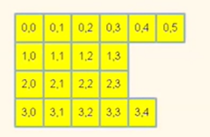
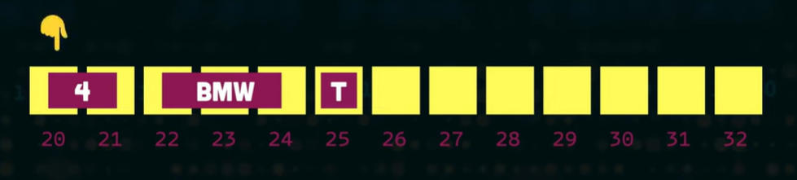
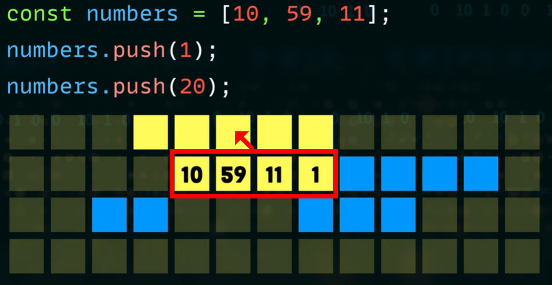

# Array (배열)
- 연속적인 메모리 구조로 이루어진 선형 자료구조
- 할당받은 연속적인 메모리의 시작 위치를 나타냄
- index는 위치 정보를 나타냄. (범위: 0~(n-1))


## ✅ Array의 장단점
### ☑️ 장점 
1. **임의 접근 가능**: index를 이용해 O(1) 시간복잡도로 데이터 접근 가능
    - 논리적 저장 순서 = 물리적 저장 순서
2. **메모리 효율성**: 사전에 정의되므로 추가 메모리 손실 X
3. **메모리 오버플로우 방지**: 사전에 크기 정의되어 시스템 안정성 확보 가능
    
### ☑️ 단점
1. **고정 크기**: 초기 선언 시 크기 정의 필수. 이후 변경 불가
2. **삽입/삭제 효율 ↓**: 중간 원소를 삽입, 삭제 시 shift 및 메모리 재할당 발생으로 성능 저하


## ✅ Array의 시간 복잡도
| Operation  | 시간 복잡도  | 설명 |
| ----- | ------- | ------- |
| Read   | O(1) | index를 통한 직접 접근 |
| Write  | O(1) | 위치를 알 경우, 즉시 수정 가능 |
| Append   | 맨 앞, 중간: O(N)  <br><br> 맨 끝: O(1) | 맨 앞, 중간 삽입 시, 기존 요소들의 index shift 발생|
| Delete   | 맨 앞, 중간: O(N) <br><br> 맨 끝: O(1) | 삭제 후 빈 공간을 채우기 위한 데이터 shift 발생 |
| Search | O(N) | 특정 값을 찾기 위해 전체 순회 필요 |

## ✅ Array 종류
- 1차원 배열 
- 다차원 배열
    - Row-major (행 우선): 행을 우선적으로 배치
        - ⓔ (0,0), (0,1), (1,0), (1,1)
    - Column-major (열 우선): 열을 우선적으로 배치
        - ⓔ (0,0), (1,0), (0,1), (1,1)


## ✅ Array 주요 연산 (Operatrion)
- 순회(Traversal)
- 삽입(Insertion)
- 삭제(Deletion)
- 검색(Searching)
- 정렬(Sorting)


## ✅ Jagged Array (가변 배열)
- a.k.a. 배열의 배열 (Array Of Arrays)
- 2차원 배열이지만, 각 행이 서로 다른 길이를 가짐
    - 1차원(주배열)만 먼저 지정하고, 2차원(내부배열)을 개별 할당
- 각 행이 메모리의 서로 다른 위치에 불연속적으로 생성/할당 됨

### ☑️ 장점
1. **메모리 효율성**: 각 행마다 필요한 만큼만 할당하여 낭비 최소화

### ☑️ 단점
1. **복잡성**: 순회 시, 각 행의 길이를 매번 확인해야 함
2. **간접 접근 방식**: 일반적인 직사각형 2차원 배열은 메모리에 모든 요소가 연속적으로 붙어있기 때문에 시작 주소만 알면 원하는 요소의 위치를 바로 찾을 수 있음. 하지만 Jagged 배열은 주 배열에서 내부 배열의 주소 참조 후, 데이터 접근 (2단계 접근)
    - 시간 오버헤드 (Time Overhead): 메모리 접근이 한 번 더 발생(주 배열 → 내부 배열)
    - 캐시 비효율성 (Cache Inefficiency): 내부 배열이 메모리에 흩어져 있으므로, 캐시 미스(Cache Miss) 확률 증가
        - CPU는 데이터를 한 번에 미리 읽어서 캐시에 보관함. 일반 배열은 모두 연속적으로 위치하기 때문에 한 번의 캐시 접근으로 많은 데이터를 가져올 수 있음


```Java
int[][] jaggedArray = new int[4][];

jaggedArray[0] = new int[6];
jaggedArray[1] = new int[4];
jaggedArray[2] = new int[4];
jaggedArray[3] = new int[5];
```



## ❓ Q&A
### 1. 배열의 크기 고정해야 하는 이유?
- 배열 끝의 인접 메모리 공간이 이미 다른 데이터에 의해 사용 중일 수 있기 때문
- 크기 확장 시 전체 요소를 새로운 메모리 위치로 복사 및 재할당하는 비용 발생


### 2. 자료 크기에 비해 매우 큰 배열 선언하면 안되는 이유?
- 실제 사용되지 않는 공간 점유로 인한 메모리 누수(Memory Leak) 및 자원 낭비 발생


### 3. 배열에서 데이터 타입이 혼합되면 안되는 이유?
- 데이터 타입마다 크기(Byte)가 다르기 때문 (예: Char,Boolean-1B, Int-2B 등)
- 타입 혼합 시 시스템이 인덱스 참조를 위해 읽어야 할 정확한 바이트 수를 계산 불가


### 4. 동적 언어(JavaScript, Ruby, PHP 등)가 가변(flexible) 크기 배열을 가질 수 있는 이유?
- 연속 공간 부족 시, 시스템이 새로운 공간을 찾아 전체 항목 이동 및 기존 주소 해제 수행



### 5. 동적 언어에서 데이터 타입 혼합이 가능한 이유? 
- 동적 언어의 배열은 데이터 값 자체가 아닌 
    - 메모리 주소를 저장하거나, 
    - 배열에서 최대 크기 요소를 기준으로, 모든 요소를 각각 Boxing하여 Heap 메모리에 저장


----

## 🔗  출처
- [the roadmap Youtube](https://www.youtube.com/watch?v=QJNwK2uJyGs)
- [Hemant Maurya](https://www.youtube.com/watch?v=1jtrQqYpt7g)