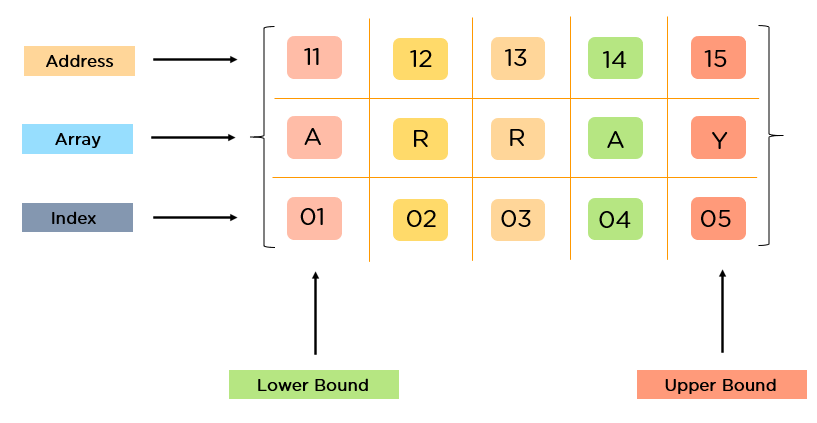
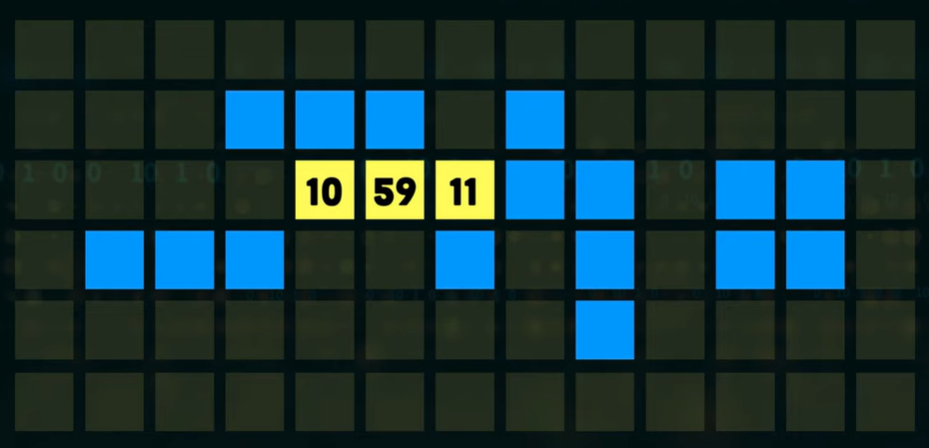
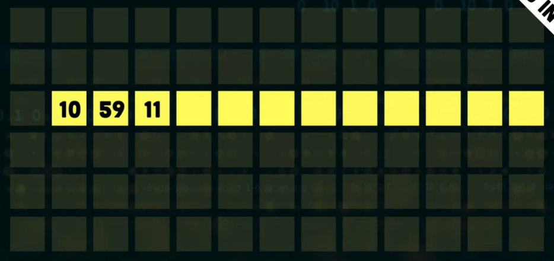
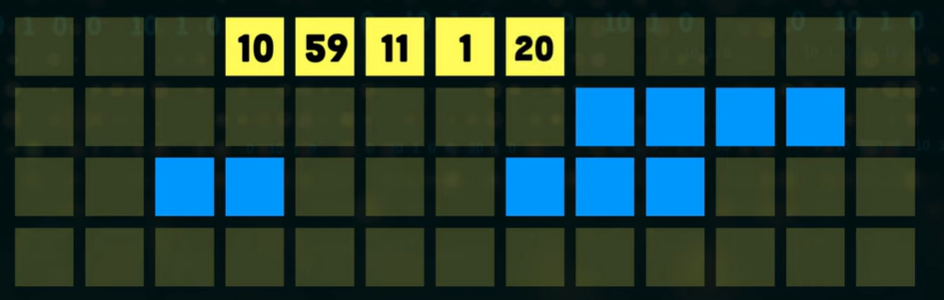
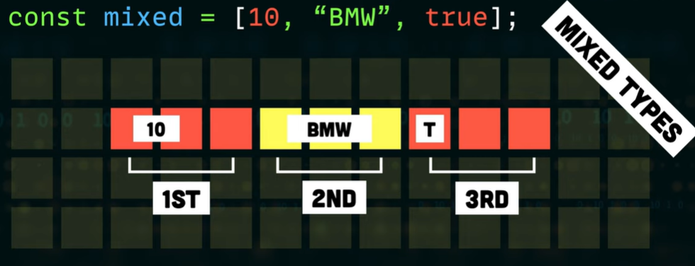

# Array (배열)
- 배열: 연속적인 메모리 구조로 이루어진 선형 자료구조
- 배열은 할당받은 연속적인 메모리의 시작 위치를 나타냄
- index는 위치 정보를 나타냄. n은 0~(n-1)

<br>

- 장점
    - index를 이용해 O(1) 시간복잡도로 접근 가능
    - 사전에 정의되므로 추가 메모리 손실 X
    - 메모리 오버플로우를 피함
- 단점
    - 크기가 미리 정의되어야 함
    - 중간 원소를 삽입, 삭제 시 shift 및 메모리 재할당이 일어나서 느림




## ✅ 배열의 시간 복잡도
| Operation  | 시간 복잡도      |
| ----- | ------- |
| Read   | O(1) |
| Write  | O(1) |
| Append   | 맨 끝: O(1) <br> 맨 앞, 중간: O(N) |
| Delete   | 맨 끝: O(1) <br> 맨 앞, 중간: O(N) |
| Search | O(N) |

## ✅ 배열 종류
- 1차원 배열 
- 다차원 배열
    - Row-major: 행을 우선적으로 배치
        - ⓔ (0,0), (0,1), (1,0), (1,1)
    - Column-major: 열을 우선적으로 배치
        - ⓔ (0,0), (1,0), (0,1), (1,1)


## ✅ 배열에서 수행할 수 있는 Operatrion
- 순회(Traversal)
- 삽입(Insertion)
- 삭제(Deletion)
- 검색(Searching)
- 정렬(Sorting)


## ✅ Jagged Array (가변 배열)
- a.k.a. Array Of Arrays (배열의 배열)
- 2차원 배열이지만, 각 행이 서로 다른 길이를 가짐
    - 1차원(주배열)만 먼저 지정하고, 2차원(내부배열)은 나중에 지정
- 각 행은 메모리의 서로 다른 위치에 개별적으로 생성/할당 됨
- 장점
    - **메모리 효율성**: 필요한 만큼만 메모리 할당하기 때문에 메모리 낭비를 줄일 수 있음
- 단점
    - **복잡성**: 순회할 때, 각 행의 길이를 계속 확인해줘야 함
    - **간접적인 접근 방식**: 일반적인 직사각형 2차원 배열은 메모리에 모든 요소가 연속적으로 붙어있기 때문에 시작 주소만 알면 원하는 요소의 위치를 바로 찾을 수 있음. 하지만 Jagged 배열은 주 배열에서 내부 배열의 주소를 얻은 후, 그 주소로 또 다시 이동해야 데이터 값을 읽을 수 있음
        - 시간 지연 (Time Overhead): 메모리 접근이 한 번 더 발생(주 배열 → 내부 배열)
        - 캐시 비효율성 (Cache Inefficiency): CPU는 데이터를 한 번에 미리 읽어서 캐시에 보관함. 일반 배열은 모두 연속적으로 위치하기 때문에 한 번의 캐시 접근으로 많은 데이터를 가져올 수 있음. Jagged 배열은 내부 배열이 메모리에 흩어져 있기 때문에 캐시 미스 확률이 높아짐.


    ```Java
    int[][] jaggedArray = new int[4][];

    jaggedArray[0] = new int[6];
    jaggedArray[1] = new int[4];
    jaggedArray[2] = new int[4];
    jaggedArray[3] = new int[5];
    ```

    

## ❓ Q&A
### 1. 배열의 크기 고정해야 하는 이유?
배열의 끝에 데이터를 추가 할당할 때, 옆 메모리 공간이 이미 사용 중이라서 할당할 수 없음. 크기를 키우려면 배열의 모든 요소를 새로운 위치로 복사, 재할당 해야함


### 2. 자료 크기에 비해 매우 큰 배열 선언하면 안되는 이유?
사용되지 않는 공간이 많이 생기면서 메모리 누수(Memory Leak)가 발생함


### 3. 배열에서 데이터 타입이 혼합되면 안되는 이유?
Boolean, Char는 각 1 byte, Int는 각 2 byte로 각 데이터 타입마다 크기가 다름. 혼합될 경우 시스템이 접근할 때 메모리를 몇 바이트씩 읽어야할 지 모름


### 4. JavaScript, Ruby, PHP 등의 동적 언어가 flexible한 크기의 배열 가질 수 있는 이유?
연속적인 메모리 공간이 없다면, 시스템은 다른 위치의 공간을 찾아서 할당함. 모든 항목을 옮기고 이전 주소를 비움



### 5. 동적 언어에서 데이터 타입의 혼합이 가능한 이유? ⚠️
동적 언어의 배열은 실제로 데이터 값 자체를 저장 X
- 메모리 주소를 저장하거나, 
- 배열에서 최대 크기를 갖는 요소를 찾아서, 전체 요소를 각각 최대 크기로 Boxing 함. 대부분 Boxing한 객체는 Heap 메모리에 저장



----

## 🔗  출처
- [the roadmap Youtube](https://www.youtube.com/watch?v=QJNwK2uJyGs)
- [Hemant Maurya](https://www.youtube.com/watch?v=1jtrQqYpt7g)